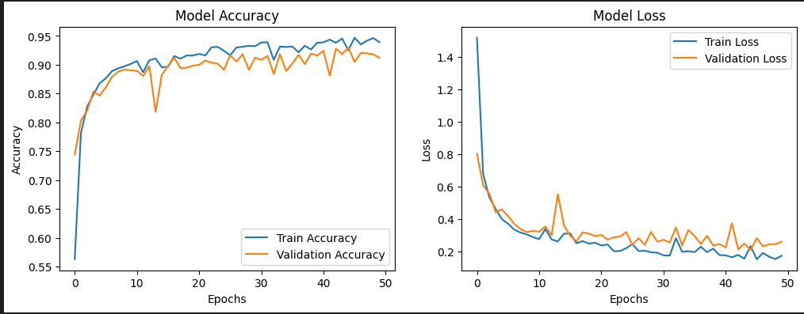
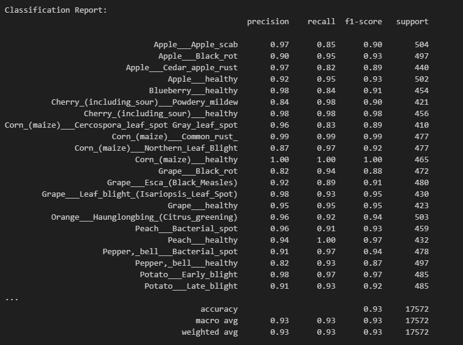

# Leaf Disease Classification using ViT Transformer
This project classifies plant leaf diseases using the Vision Transformer (ViT) model. ViT processes images as sequences of patches, enabling high accuracy in image classification. The model aids early disease detection in crops, improving agricultural efficiency by reducing crop loss through precision farming.

## Key Features

- **Vision Transformer (ViT) Architecture:** This model leverages the Vision Transformer (ViT), which splits the input image into smaller patches and processes them using a transformer-based attention mechanism. It has proven to be highly effective for large datasets and complex image classification tasks.
- **Data Preprocessing:** The dataset undergoes essential preprocessing steps like resizing, normalization, and augmentation to enhance model accuracy and generalization.
- **End-to-End Workflow:** The repository includes everything needed to load the dataset, preprocess it, train the ViT model, and evaluate its performance, all within a Jupyter notebook (train.ipynb).
- **Evaluation:** Performance evaluation is done using various metrics like accuracy, precision, recall, F1 score, and confusion matrices to understand the model's effectiveness on the test dataset.

## Project Structure:
- **train.ipynb:** Jupyter notebook for training, evaluating, and testing the Vision Transformer (ViT) model on the plant disease dataset.
- **requirements.txt:** Contains the dependencies required to run the code.

## Installation Instructions:

- Clone the repository:
    ```bash
    git clone https://github.com/your-username/leaf-disease-classification-vitam.git
    cd leaf-disease-classification-vitam
    ```
- Install the dependencies:
    ```bash
    pip install -r requirements.txt
    ```
- Download the dataset from Kaggle:
  
  - [New Plant Diseases Dataset](https://www.kaggle.com/datasets/vipoooool/new-plant-diseases-dataset)
  
      This dataset is recreated using offline augmentation from the original dataset. The original dataset can be found on this github repo. This dataset consists of about 87K rgb images of healthy and diseased crop leaves which is categorized into 38 different classes. The total dataset is divided into 80/20 ratio of training and validation set preserving the directory structure. A new directory containing 33 test images is created later for prediction purpose.

## Usage:

- **Train and Evaluate the Model:** Open the train.ipynb notebook and execute the cells to train and evaluate the model on the dataset.
  ```bash
  jupyter notebook train.ipynb
  ```
The notebook will guide you through:
- Loading the dataset
- Training the Vision Transformer (ViT) model
- Evaluating the model's performance
- Visualizing results and confusion matrices

## Results and Analysis:

The Vision Transformer (ViT) model achieves ~93% accuracy on the test dataset. Detailed results, including confusion matrices and classification reports, are available within the train.ipynb notebook. These metrics provide insights into the model's ability to classify various leaf diseases accurately.

- Training VS Validationplot:

  

- Classification Report:
  
  
  
